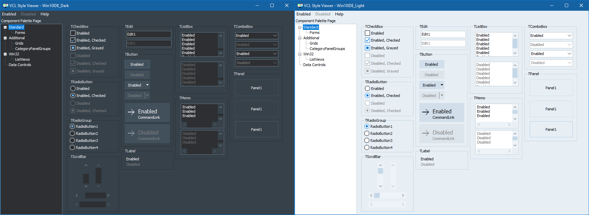

# RAD Studio VCL Styles

## About

The user interface of RAD Studio 10.3 and onward has been upgraded to a new
flat look based on custom VCL styles. These styles were unavailable to end
users, so I have extracted them directly from the application's files.

## Changelog

### 25 October 2020

- Extracted styles from RAD Studio 10.4.1 Sydney; updated repository.
- Cleaned Git history, packages, etc.

### 27 November 2018
 
- Extracted styles from RAD Studio 10.3 Rio, created repository.
